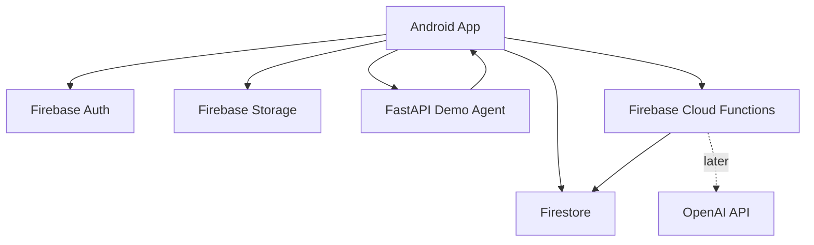
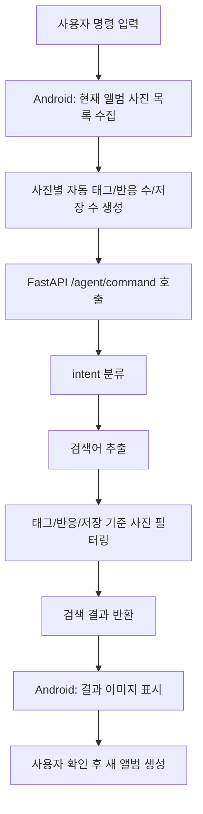
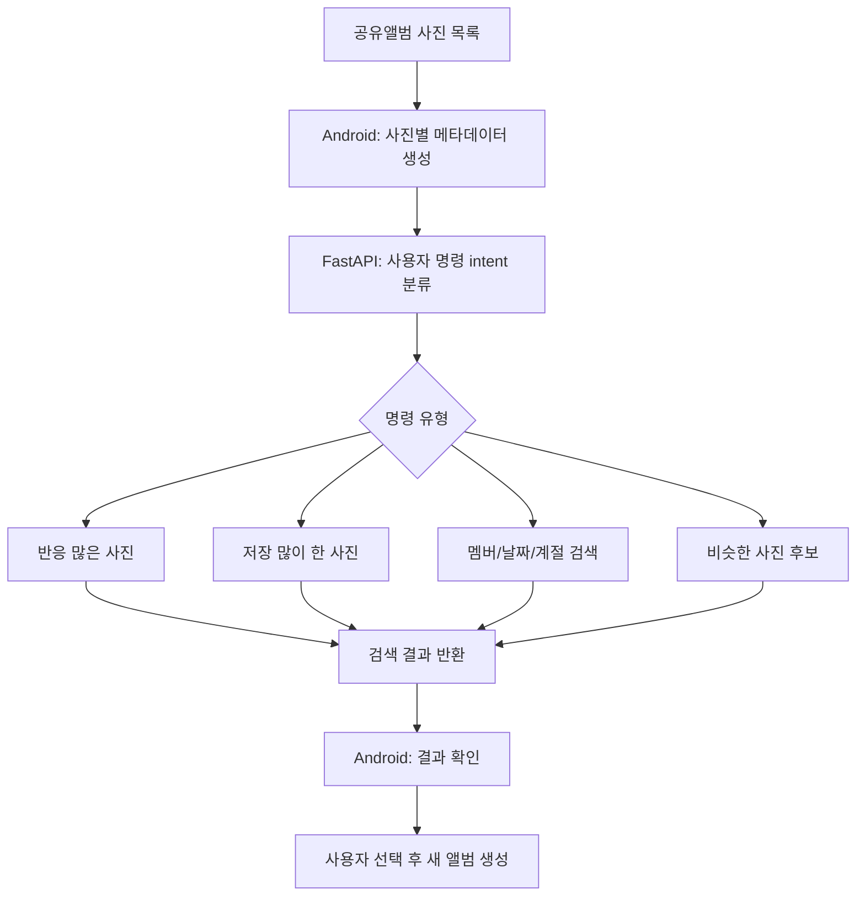

# Momento

FastAPI 기반 스마트 검색을 결합한 공유 앨범 Android 앱

Momento는 친구, 가족, 여행 멤버가 함께 사진을 업로드하고 댓글과 반응을 남길 수 있는 공유 앨범 앱입니다. 초대코드로 앨범에 참여할 수 있고, 스마트 정리 탭에서 “올해 사진 보여줘”, “좋아요 많은 사진으로 베스트 앨범 만들어줘”처럼 자연어에 가까운 명령으로 사진을 찾거나 새 앨범을 만들 수 있습니다.

현재 버전은 OpenAI 비용 문제를 고려해 실제 LLM/Vision 호출 대신 FastAPI 기반 Demo Agent로 구현했습니다. Android 앱이 현재 앨범의 사진 URL, 자동 생성 태그, 반응 수, 저장 수를 FastAPI 서버로 전달하면, 서버가 날짜, 계절, 업로더, 반응, 저장 기록 등 공유앨범 특화 데이터를 기준으로 사진을 검색하고 결과를 반환합니다. 이후 OpenAI Vision/Embedding을 연결하면 사진 내용 기반 자동 태깅과 의미 검색으로 확장할 수 있도록 구조를 분리했습니다.

## 주요 기능

- Firebase Auth 기반 이메일 로그인/회원가입
- 로그인 상태 유지
- 초대코드 기반 앨범 참여
- 앨범 생성, 이름 수정, 삭제
- 앨범 주인/멤버 권한 구분
- 멤버 목록 보기 및 멤버 내보내기
- 여러 장 사진 업로드
- 업로드 중 로딩/진행 상태 표시
- 썸네일 생성 및 그리드 로딩 최적화
- 사진 크게 보기, 다운로드/저장
- 여러 장 선택 후 저장/삭제
- 사진별 업로더, 업로드 날짜 표시
- 사진 반응 및 댓글 작성
- 카메라 촬영 후 현재 공유앨범에 바로 업로드
- 마이페이지에서 프로필, 참여 앨범, 저장한 사진 확인
- 마이페이지에서 공유앨범별 저장 사진으로 나만의 앨범 생성
- FastAPI 기반 스마트 사진 검색 및 공유앨범 큐레이션
- 반응 많은 사진으로 베스트 앨범 생성
- 저장 많이 한 사진으로 새 앨범 생성
- 멤버/업로더, 날짜, 계절 기반 사진 검색
- 비슷한 사진 후보 확인
- 검색 결과 기반 새 앨범 생성
- Firestore Security Rules 기반 권한 제어

## 문제 정의

메신저로 여행 사진을 주고받으면 시간이 지나면서 사진을 다시 찾기 어렵습니다. 특히 “작년 여행 사진”, “7월 사진”, “내가 저장한 사진”처럼 기억은 나지만 정확한 날짜나 파일명을 모르는 경우가 많습니다.

Momento는 공유 앨범과 자연어 기반 검색 흐름을 결합해, 사진을 함께 모으고 나중에 더 쉽게 다시 찾는 경험을 목표로 했습니다. 특히 개인 사진첩이 아니라 여러 사람이 함께 만든 공유앨범을 다시 큐레이션하는 흐름에 집중했습니다.

## 차별화 포인트

아이폰 사진 앱은 개인 기기의 사진을 사람, 장소, 날짜 기준으로 자동 분류하는 데 강점이 있습니다. Momento는 이와 다르게 공유앨범 안에서 발생하는 협업 데이터를 활용합니다.

- 반응 기반 큐레이션: 공유앨범 멤버들이 좋아요와 반응을 남긴 사진을 기준으로 베스트 앨범을 만들 수 있습니다.
- 저장 기반 큐레이션: 사용자가 저장한 사진 기록을 기반으로 마이페이지에서 나만의 앨범을 만들 수 있습니다.
- 멤버/업로더 기반 정리: 특정 멤버가 올린 사진만 검색하거나 새 앨범으로 재구성할 수 있습니다.
- 확인 중심 UX: 중복/비슷한 사진은 자동 삭제하지 않고 후보만 보여주어 사용자가 직접 판단할 수 있게 했습니다.
- 공유앨범 재구성: 기존 앨범의 사진 파일을 복사하지 않고 URL을 참조해 새 앨범 문서를 만들어, 원본 앨범과 큐레이션 앨범을 독립적으로 관리합니다.

## 기술 스택

### Android

- Kotlin
- Jetpack Compose
- Coil
- Retrofit

### Firebase

- Firebase Auth
- Firebase Firestore
- Firebase Storage
- Firebase Cloud Functions
- Firestore Security Rules

### Backend

- FastAPI
- Firebase Functions 2nd Gen
- Firebase Admin SDK
- OpenAI API 확장 구조

## 시스템 구조



## FastAPI Demo Agent 흐름



현재 자동 태그는 사진 내용이 아니라 앱에서 알 수 있는 기본 메타데이터를 사용합니다.

- 연도: `2026`, `2026년`
- 월/일: `7월`, `20일`, `7월 20일`
- 계절: `봄`, `여름`, `가을`, `겨울`
- 기간: `상반기`, `하반기`
- 업로더: 닉네임, 이메일 앞부분
- 반응 수: 사진별 반응 총합
- 저장 수: 사진을 저장한 사용자 수

## 공유앨범 큐레이션 흐름



## 주요 구현 포인트

### Android와 FastAPI 연결

Android 앱은 Retrofit을 사용해 FastAPI의 `/agent/command` API로 사용자 명령과 사진 목록을 전달합니다.

- `FastApiRepository.kt`: FastAPI 통신 담당
- `AgentCommandRequest`: 사용자 명령과 사진 목록 요청 모델
- `AgentCommandResponse`: intent, 검색 결과, 추천 앨범 제목 응답 모델

### 스마트 검색

FastAPI는 사용자 문장에서 불필요한 단어를 제거하고 검색 키워드를 추출합니다. 또한 `올해`, `작년`, `이번 달`, `지난달` 같은 표현을 현재 날짜 기준의 연도/월 키워드로 변환합니다.

예시:

- `올해 사진 보여줘` → `2026년`, `2026`
- `이번 달 사진 보여줘` → `7월`
- `여름 사진 보여줘` → `여름`

### 검색 결과 기반 새 앨범 생성

사용자가 “여름 사진으로 앨범 만들어줘”라고 입력하면 FastAPI는 `CREATE_ALBUM_FROM_PHOTOS` intent와 검색 결과, 추천 앨범 제목을 반환합니다. Android는 검색 결과를 먼저 보여주고, 사용자가 확인 버튼을 누른 뒤 Firestore에 새 앨범을 생성합니다.

새 앨범 생성 시 Storage 파일을 새로 복사하지 않고 기존 `imageUrl`을 참조합니다. 대신 새 앨범에는 별도의 photo 문서를 생성해 원본 앨범과 독립적으로 관리합니다.

### 반응/저장 기반 큐레이션

사진 문서에는 `reactions`와 `savedBy`가 저장됩니다. Android는 각 사진의 반응 수와 저장 수를 계산해 FastAPI로 전달하고, FastAPI는 명령에 따라 사진을 정렬하거나 필터링합니다.

예시:

- `좋아요 많은 사진만 모아서 베스트 앨범 만들어줘`
- `저장 많이 한 사진으로 앨범 만들어줘`
- `민지가 올린 사진만 보여줘`
- `비슷한 사진 후보 보여줘`

현재 비슷한 사진 후보는 OpenAI/이미지 임베딩 없이 업로드 시점, 업로더, 날짜/계절 태그가 가까운 사진을 후보로 보여주는 데모 방식입니다. 실제 중복 이미지 판별은 추후 CLIP/Embedding 기반으로 확장할 수 있습니다.

### 카메라 즉시 업로드

앨범 상세 화면의 사진 추가 영역에서 `카메라`를 누르면 Android 카메라 앱으로 사진을 촬영하고, 촬영된 이미지 URI를 기존 업로드 함수에 전달합니다. 따라서 카메라 촬영 사진도 갤러리 업로드와 동일하게 Firebase Storage에 원본/썸네일로 저장되고 Firestore photo 문서가 생성됩니다.

### 마이페이지 저장 사진 앨범화

사진을 저장하면 `users/{uid}/savedPhotos`에 개인 저장 기록이 남고, 원본 사진 문서의 `savedBy`에도 사용자 id가 추가됩니다. 마이페이지에서는 저장한 사진을 원래 공유앨범별로 묶어 보여주고, 사용자가 `만들기`를 누르면 해당 저장 사진들로 나만의 새 앨범을 생성합니다.

## 프로젝트 구조

```text
app/src/main/java/com/example/sharealbum/
  MainActivity.kt                  # 화면 흐름과 주요 상태
  data/
    FirebaseAlbumRepository.kt     # Firestore/Storage 앨범, 사진, 댓글 기능
    FastApiRepository.kt           # Android -> FastAPI 통신
    AiAgentRepository.kt           # 추후 OpenAI/Cloud Functions 재연결용
  model/
    Models.kt                      # 앱 데이터 모델
  ui/
    AiTab.kt                       # 스마트 검색 탭
    PhotoComponents.kt             # 사진 카드, 이미지 로딩, 선택 액션바
    CommonComponents.kt            # 공통 UI 컴포넌트
    ProfileDialogs.kt              # 프로필/마이페이지

fast/
  main.py                          # FastAPI Demo Agent

functions/
  src/index.ts                     # Firebase Functions/OpenAI 확장 코드

docs/
  architecture.mmd                 # 시스템 구조 Mermaid 다이어그램
  curation-flow.mmd                # 공유앨범 큐레이션 흐름 Mermaid 다이어그램
```

## 실행 방법

### FastAPI 서버 실행

```bash
cd /Users/jeongjihye/AndroidStudioProjects/ShareAlbum/fast
uvicorn main:app --reload --host 0.0.0.0 --port 8000
```

브라우저 확인:

```text
http://127.0.0.1:8000/docs
```

### Android 앱에서 로컬 FastAPI 연결

현재 Android 앱은 개발 편의를 위해 다음 주소를 사용합니다.

```kotlin
http://127.0.0.1:8000/
```

Android 에뮬레이터/기기에서 이 주소가 Mac의 FastAPI 서버로 연결되도록 아래 명령을 실행합니다.

```bash
/Users/jeongjihye/Library/Android/sdk/platform-tools/adb reverse tcp:8000 tcp:8000
```

에뮬레이터만 사용할 경우 `FastApiRepository.kt`의 baseUrl을 `http://10.0.2.2:8000/`로 바꿔 사용할 수도 있습니다.

## 트러블슈팅

### Cloud Functions 배포 문제

Firebase Functions 2nd Gen 배포 과정에서 `pnpm-lock.yaml`과 `package.json`의 의존성 정보가 맞지 않아 배포가 실패했습니다. 또한 Functions Framework 의존성 누락으로 빌드 오류가 발생했습니다.

이를 해결하기 위해 Functions Framework 의존성을 명시적으로 추가하고 lockfile을 갱신했습니다. 이 과정을 통해 Firebase Functions 2nd Gen은 배포 환경에서 lockfile 일관성과 런타임 의존성 관리가 중요하다는 점을 확인했습니다.

### OpenAI quota 문제

OpenAI API 호출 중 `insufficient_quota` 오류가 발생했습니다. 초기에는 OpenAI Vision과 Embedding을 활용해 사진 자동 태깅과 자연어 검색을 구현하려 했지만, 개발 단계에서 외부 AI API 비용에 계속 의존하면 테스트가 어렵다고 판단했습니다.

따라서 첫 번째 버전에서는 OpenAI 호출을 잠시 비활성화하고 FastAPI 기반 Demo Agent로 전환했습니다. Demo Agent는 Android 앱에서 전달한 사진 목록과 자동 생성된 기본 태그를 기반으로 날짜별, 계절별, 사용자별 사진 검색을 수행합니다. 이후 OpenAI API를 다시 연결하면 기존 FastAPI 구조를 유지한 채 사진 내용 기반 자동 태깅과 의미 검색으로 확장할 수 있도록 설계했습니다.

### 사진 로딩 문제

원본 이미지를 그리드 화면에 직접 렌더링할 경우 이미지 로딩 속도가 느려지고, 여러 장의 사진을 한 번에 불러올 때 사용자 경험이 떨어지는 문제가 있었습니다.

이를 개선하기 위해 사진 업로드 시 원본 이미지와 별도로 썸네일 이미지를 생성하고 Firebase Storage에 함께 저장하도록 구현했습니다. 그리드 화면에서는 원본 대신 `thumbnailUrl`을 우선 사용하고, 사진 상세 화면에서만 원본 이미지를 불러오도록 분리해 초기 로딩 속도와 스크롤 체감을 개선했습니다.

### Android와 FastAPI 로컬 서버 연결 문제

FastAPI 서버는 로컬 PC에서 실행되고 Android 앱은 에뮬레이터 내부에서 실행되기 때문에 `localhost` 주소를 그대로 사용할 경우 연결 실패가 발생했습니다. Android 앱 내부의 `127.0.0.1`은 로컬 PC가 아니라 에뮬레이터 자기 자신을 가리키기 때문입니다.

이를 해결하기 위해 두 가지 방식을 비교했습니다.

- 에뮬레이터 전용 주소인 `10.0.2.2:8000` 사용
- `adb reverse tcp:8000 tcp:8000` 명령을 사용해 Android 기기의 `127.0.0.1:8000` 요청을 로컬 PC의 FastAPI 서버로 전달

개발 환경에서는 `adb reverse`를 사용해 Android 앱과 FastAPI 서버를 연결했습니다. 이를 통해 Android → FastAPI → 검색 결과 반환 흐름을 로컬 환경에서 검증할 수 있었습니다.

### 검색 결과가 화면에 표시되지 않던 문제

초기 FastAPI 연동 단계에서는 사용자의 자연어 명령을 intent로 분류하고 Android에서 사진 목록을 서버로 전달하는 것까지만 구현되어 있었습니다. 이로 인해 “7월 사진 보여줘”와 같은 명령을 입력해도 실제 사진 결과가 화면에 표시되지 않고 “사진을 전달받았습니다”라는 응답만 표시되는 문제가 있었습니다.

이를 해결하기 위해 FastAPI 응답에 `matched_photo_count`와 `photos` 필드를 추가하고, 서버에서 검색어와 사진별 자동 태그를 비교해 조건에 맞는 사진만 반환하도록 수정했습니다. Android에서는 반환된 `photos` 목록을 받아 스마트 검색 탭에 이미지 카드 형태로 표시하도록 구현했습니다.

### 검색 결과 기반 앨범 생성 실패

FastAPI 검색 결과로 새 앨범을 만들 때 앨범 문서와 사진 문서를 하나의 Firestore batch에서 함께 생성하면 보안 규칙 검사 시점 문제로 실패할 수 있었습니다. 사진 생성 규칙은 사용자가 이미 해당 앨범의 멤버인지 확인하는데, 같은 batch 안에서는 앨범 생성이 완전히 반영되기 전이기 때문입니다.

이를 해결하기 위해 새 앨범과 초대코드 문서를 먼저 생성하고, 성공 후 해당 앨범의 photos 하위 컬렉션에 검색 결과 사진 문서를 추가하는 2단계 저장 방식으로 변경했습니다.

### 저장 기반 큐레이션 권한 문제

저장 많이 한 사진을 찾기 위해 사진 문서에 `savedBy` 필드를 추가했습니다. 하지만 기존 Firestore Security Rules는 사진 업데이트 시 `reactions`, `commentCount`만 허용하고 있었기 때문에 저장 기록 업데이트가 실패할 수 있었습니다.

이를 해결하기 위해 사진 문서 업데이트 허용 필드에 `savedBy`를 추가했습니다. 이때 전체 사진 문서를 아무나 수정할 수 있게 열지 않고, 기존처럼 앨범 멤버만 제한된 필드만 수정할 수 있도록 허용 범위를 좁게 유지했습니다.

### 카메라 촬영 이미지 업로드

Android에서 카메라로 찍은 사진을 바로 업로드하려면 카메라 앱이 저장할 수 있는 안전한 파일 URI가 필요했습니다. 단순 파일 경로를 직접 전달하면 Android 보안 정책에 막힐 수 있기 때문에 `FileProvider`를 설정하고, 촬영 결과 URI를 기존 업로드 함수에 전달하는 방식으로 구현했습니다.

### MainActivity 코드 비대화 문제

초기 구현에서는 로그인, 앨범 목록, 앨범 상세, 사진 그리드, 스마트 검색, 멤버 관리 등의 UI와 로직이 `MainActivity.kt`에 집중되어 코드 길이가 길어지고 유지보수가 어려웠습니다.

이를 개선하기 위해 스마트 검색 화면은 `AiTab.kt`, 사진 카드와 이미지 로딩 컴포넌트는 `PhotoComponents.kt`, 공통 UI 요소는 `CommonComponents.kt`, 마이페이지와 프로필 화면은 `ProfileDialogs.kt`로 분리했습니다. 기능별 파일 분리를 통해 코드의 역할을 명확히 하고, 이후 관련 기능을 수정할 때 필요한 파일만 확인할 수 있도록 구조를 개선했습니다.

## 향후 개선 계획

- OpenAI Vision 또는 사전학습 이미지 모델을 활용한 사진 내용 기반 자동 태깅
- Embedding/CLIP 기반 의미 검색
- LangGraph 기반 다단계 Agent 흐름 적용
- 검색 결과 앨범 생성 전 확인/편집 UX 강화
- Firestore pagination 적용으로 대규모 앨범 성능 개선
- Firebase Functions와 FastAPI 배포 환경 분리 정리

## 면접 답변 포인트

> OpenAI API를 바로 운영에 붙이기 전, 비용 문제를 고려해 FastAPI 기반 Demo Agent를 먼저 구현했습니다. 사용자의 자연어 명령을 intent로 분류하고, Android 앱에서 전달한 사진 메타데이터를 기반으로 날짜/계절/사용자별 검색을 수행했습니다. 또한 검색 결과로 새 앨범을 생성하는 흐름까지 구현했고, 이후 OpenAI Vision이나 LLM을 붙이면 자동 태깅과 의미 검색으로 확장할 수 있도록 구조를 분리했습니다.
