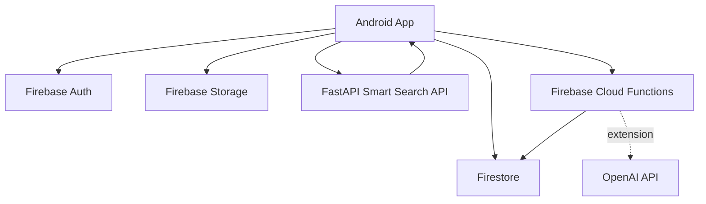
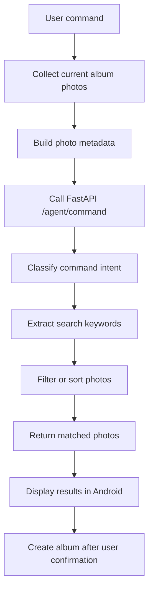
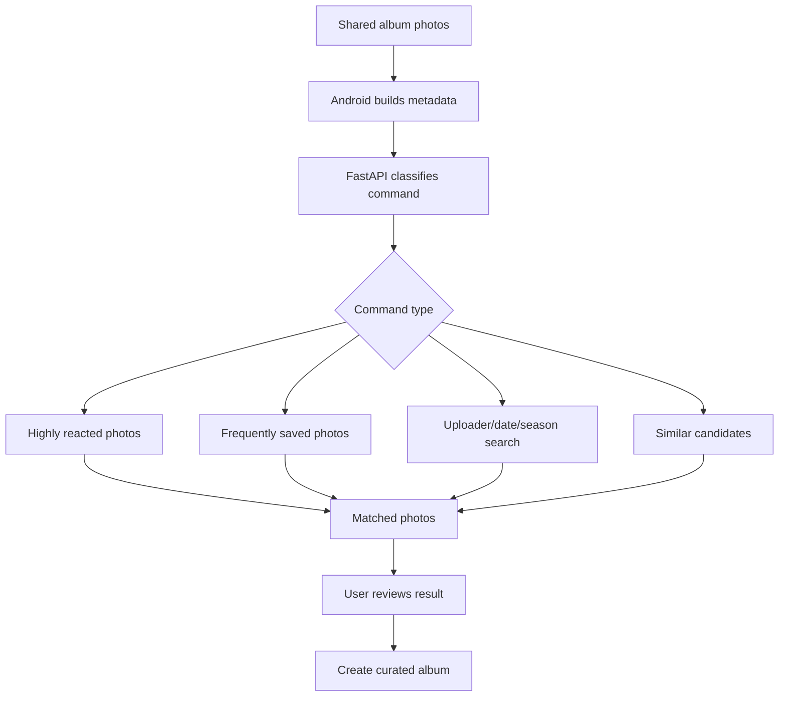

# Momento

Momento is an Android shared album app for collecting, organizing, and revisiting photos with friends, family, or travel groups.

Users can create albums, invite members with an invite code, upload photos, leave comments and reactions, and reorganize shared photos into curated albums.

## Overview

Shared photos often become difficult to find after they are exchanged through messengers or saved across multiple devices. Momento focuses on the shared album context: who uploaded a photo, when it was uploaded, how members reacted to it, and which photos were saved.

Unlike a personal photo gallery, Momento uses collaboration data from a shared album to help users find and reorganize photos.

## Key Features

- Email sign up and login with Firebase Auth
- Persistent login state
- Album creation, rename, and deletion
- Invite code based album join
- Album owner/member permission handling
- Member list and member removal
- Multi-photo upload
- Camera capture and immediate album upload
- Upload progress feedback
- Thumbnail generation for faster grid loading
- Three-column photo grid
- Photo detail view
- Photo download/save
- Multi-select save/delete
- Uploader name and upload date display
- Photo reactions and comments
- My Page with profile, joined albums, and saved photos
- Saved-photo based personal album creation
- FastAPI based smart photo search
- Curated album creation from search results
- Best album creation from highly reacted photos
- Album creation from frequently saved photos
- Uploader, date, and season based search
- Similar photo candidate view
- Firestore Security Rules for access control

## Product Differentiation

Momento is designed around collaborative photo curation.

Personal photo apps can classify photos by face, location, and date. Momento focuses on the additional data that appears only in shared albums:

- Reactions from album members
- Saved photos
- Photo uploader information
- Album membership and ownership
- Shared album context

This enables workflows such as:

- "Show photos I uploaded"
- "Create a best album from highly reacted photos"
- "Create an album from photos saved by members"
- "Group photos by uploader"
- "Show similar photo candidates before deciding what to keep"

## Tech Stack

### Android

- Kotlin
- Jetpack Compose
- Coil
- Retrofit

### Firebase

- Firebase Auth
- Firebase Firestore
- Firebase Storage
- Firebase Cloud Functions
- Firestore Security Rules

### Backend

- FastAPI
- Firebase Functions 2nd Gen
- Firebase Admin SDK
- OpenAI API extension-ready structure

## Architecture



## Smart Search Flow



The current smart search implementation uses metadata available in the app:

- Year and month
- Season
- Upload date
- Uploader nickname/email prefix
- Reaction count
- Save count

## Shared Album Curation Flow



## Main Implementation Points

### Android and FastAPI Integration

The Android app uses Retrofit to send the user's command and the current album's photo metadata to FastAPI.

- `FastApiRepository.kt`: Android to FastAPI communication
- `AgentCommandRequest`: request model containing user command and photo list
- `AgentCommandResponse`: response model containing matched photos and suggested album title

### Metadata-Based Search

FastAPI extracts keywords from user commands and compares them with metadata generated on Android.

Example commands:

- `올해 사진 보여줘`
- `이번 달 사진 보여줘`
- `여름 사진 보여줘`
- `내가 올린 사진만 보여줘`
- `좋아요 많은 사진만 모아서 베스트 앨범 만들어줘`

### Curated Album Creation

When a command requests album creation, the app first shows the matched photos. After user confirmation, a new album is created in Firestore.

The curated album references the existing photo URL instead of copying the image file. Each curated album still has its own photo documents, so it can be managed independently from the source album.

### Reaction and Save Based Curation

Photo documents store reactions and saved-user data.

- `reactions`: reaction type mapped to user ids
- `savedBy`: user ids that saved the photo

Android calculates `reaction_count` and `save_count` for each photo and sends them to FastAPI. FastAPI uses these values to sort photos for best albums or frequently saved photo albums.

### Camera Upload

The album detail screen supports adding photos from the gallery or camera. Camera capture uses `FileProvider` to generate a safe URI, then reuses the existing upload pipeline.

Uploaded photos are stored in Firebase Storage with:

- Original image
- Thumbnail image
- Firestore photo metadata

### My Page Saved Photo Albums

When a user saves a photo, the app records it under:

```text
users/{uid}/savedPhotos/{savedPhotoId}
```

My Page groups saved photos by source album and lets the user create a new personal album from those saved photos.

## Project Structure

```text
app/src/main/java/com/example/sharealbum/
  MainActivity.kt
  data/
    FirebaseAlbumRepository.kt
    FastApiRepository.kt
    AiAgentRepository.kt
  model/
    Models.kt
  ui/
    AiTab.kt
    PhotoComponents.kt
    CommonComponents.kt
    ProfileDialogs.kt

fast/
  main.py

functions/
  src/index.ts

docs/
  architecture.mmd
  curation-flow.mmd
```

## Local Development

### FastAPI

```bash
cd fast
uvicorn main:app --reload --host 0.0.0.0 --port 8000
```

Swagger UI:

```text
http://127.0.0.1:8000/docs
```

### Android

Run the app from Android Studio using an emulator or Android device.

When using an emulator with a local FastAPI server, configure the API base URL according to the development environment.

Common options:

```text
http://10.0.2.2:8000/
```

or use port forwarding with:

```bash
adb reverse tcp:8000 tcp:8000
```

## Security

Firestore Security Rules restrict access based on authentication, album membership, and album ownership.

- Only authenticated users can access app data.
- Only album members can read album photos and comments.
- Only album owners can delete albums or remove members.
- Photo deletion is limited to the album owner or the original uploader.
- Reactions, comment counts, and saved-user data are the only mutable photo interaction fields.

## Engineering Notes

### Photo Grid Loading

Rendering original images directly in the grid caused slow loading and poor scrolling performance when an album contained multiple photos.

To improve perceived performance, the upload flow now creates a thumbnail image in addition to the original image. The grid uses `thumbnailUrl`, while the detail view loads the original `imageUrl`.

### Android and FastAPI Local Connection

The Android app and FastAPI server run in different network contexts during development. A `localhost` address inside an emulator or device does not always point to the development machine.

The project supports two common development approaches:

- Use the emulator host address such as `10.0.2.2`
- Forward the device port with `adb reverse tcp:8000 tcp:8000`

This keeps the Android app, Retrofit API layer, and FastAPI server testable before deploying the backend.

### Search Result Album Creation

Creating an album document and its photo documents in a single Firestore batch can conflict with security rules that check album membership before allowing photo creation.

To avoid this, curated album creation is split into two steps:

1. Create the album and invite code documents.
2. After the album exists, create photo documents under the new album.

This keeps the write flow compatible with membership-based Firestore Security Rules.

### Save-Based Curation Rules

The app uses `savedBy` to support frequently saved photo curation. Since this field is stored on the photo document, the security rules needed to allow album members to update only specific interaction fields.

The update rule allows changes to `reactions`, `commentCount`, and `savedBy`, while preventing arbitrary photo metadata updates.

### Camera Capture Upload

Camera capture requires a safe URI that can be shared with the camera app. The project uses `FileProvider` to create a temporary image URI, then passes that URI into the existing upload pipeline.

This avoids duplicating upload logic and keeps gallery upload and camera upload behavior consistent.

### MainActivity Refactoring

The initial screen logic became difficult to maintain as album management, photo grid, comments, reactions, smart search, and profile screens grew.

The UI was separated into focused files:

- `AiTab.kt` for smart search and curation
- `PhotoComponents.kt` for photo grid and image components
- `CommonComponents.kt` for shared UI elements
- `ProfileDialogs.kt` for profile and My Page screens

## Future Improvements

- Server deployment for FastAPI
- Image-content based automatic tagging
- Embedding based semantic photo search
- More accurate duplicate detection
- Pagination for large albums
- Push notifications for album activity
