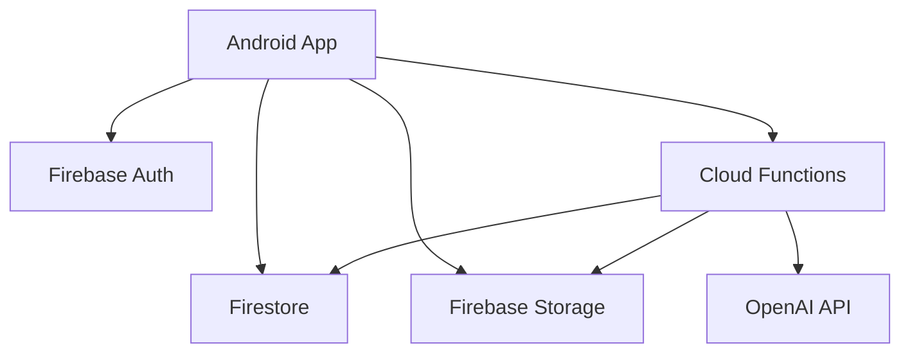

# Momento

AI Agent 기반 공유 앨범 앱

Momento는 친구, 가족, 여행 멤버가 함께 사진을 업로드하고 댓글과 반응을 남길 수 있는 공유 앨범 앱입니다. 초대코드로 앨범에 참여할 수 있고, AI Agent를 통해 “강아지 사진만 보여줘”, “작년 제주 여행 사진으로 새 앨범 만들어줘” 같은 자연어 명령을 처리하는 것을 목표로 했습니다.

## 주요 기능

- 이메일 로그인/회원가입
- 초대코드 기반 앨범 참여
- 앨범 생성, 이름 수정, 삭제
- 멤버 목록 보기, 멤버 내보내기
- 여러 장 사진 업로드
- 썸네일 생성 및 그리드 최적화
- 사진 크게 보기, 다운로드/저장
- 여러 장 선택 후 저장/삭제
- 사진별 업로더, 업로드 날짜 표시
- 반응 및 댓글 작성
- 마이페이지에서 참여 앨범과 저장한 사진 확인
- AI 자연어 사진 검색
- AI 조건 기반 새 앨범 생성
- Firestore Security Rules 기반 권한 제어

## 문제 정의

카카오톡이나 메신저에서 여행 사진을 주고받으면 시간이 지나면서 사진을 다시 찾기 어렵습니다.  
특히 “작년 제주도에서 찍은 강아지 사진”처럼 기억은 나지만 정확한 날짜나 파일명을 모르는 경우가 많습니다.

Momento는 공유 앨범과 AI 검색을 결합해, 사진을 함께 모으고 자연어로 다시 찾을 수 있는 경험을 목표로 했습니다.

## 기술 스택

### Android
- Kotlin
- Jetpack Compose
- Coil
- Firebase Auth
- Firebase Firestore
- Firebase Storage

### Backend
- Firebase Cloud Functions
- Firebase Admin SDK
- OpenAI API

### AI
- Vision 기반 이미지 메타데이터 추출
- Embedding 기반 자연어 검색
- 사용자 프롬프트 intent parsing
- 조건에 맞는 사진 자동 선별
- AI 앨범 생성

## 시스템 구조

## 트러블슈팅
Cloud Functions 배포 문제
Firebase Functions 2nd Gen 배포 중 pnpm lockfile과 Functions Framework 의존성 문제를 해결했습니다.
OpenAI quota 문제
OpenAI API 호출 시 insufficient_quota 오류를 확인했고, 비용 문제를 고려해 demo mode 필요성을 정리했습니다.
사진 로딩 문제
원본 이미지를 그리드에 직접 렌더링하면 로딩이 느려져, 앱에서 썸네일을 직접 생성해 Storage에 저장하는 방식으로 개선했습니다.
